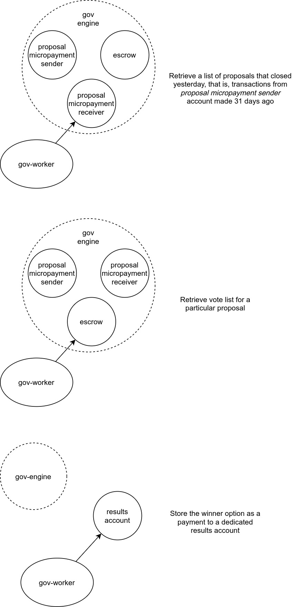

# gov-worker

## Overview

This application is intended to run once a day to count the votes for a proposal, determine the winner option and saving the results on the blockchain.

## How does it work?

Proposals have a fixed deadline of 30 days since creation, so we query for transactions 31 days ago (30 days since proposal creation plus 1 day for safety margin) on the "proposal micropayment receiver" account (to know more about the inner workings of the governance engine check the [gov repository](https://github.com/PlutoDAO/gov)), we filter them by proposal Id (the asset name used to make the micropayments), we then retrieve the votes (claimable balances) to our escrow account based on that proposal Id and procede with the vote count but first we calculate the value for each vote with the next formula:

`Vote value = amount locked * asset price in XLM * asset multiplier`

after that its simply a matter of summing up the votes for each option.

Finally, the results are saved as a payment from the "proposal micropayment receiver" to a dedicated results account with the following convention:

- The asset used for the payment is the same as the one used for the micropayments, the asset name acts as a proposal Id
- The amount represents the index of the option in the Options list of the Proposal domain object + 1; if the vote ends up a draw then no amount is paid, we just create a trustline for that asset.

Here is a diagram that shows the interaction between the worker and the required accounts:

## Requirements
* .NET 5
* Docker
* docker-compose

## Installation

Execute

1. `dotnet restore`
2. `dotnet build`
3. `dotnet run`

Or simply `dotnet run`

## How to run integration tests
1) Copy the file `PlutoDAO.Gov.Test.Integration/appsettings.test.json.dist` name it `appsettings.dev.json` and place it in `PlutoDAO.Gov.Test.Integration/bin/Debug/net5.0/`
2) Run docker-compose up from within `PlutoDAO.Gov.Test.Integration` directory, now you'll have a local instance of Stellar running on your localhost on port 8000
3) Execute `dotnet test`

## Community
Join PlutoDAO community at [Discord](https://discord.gg/xvDPZ3ZY6d)!
